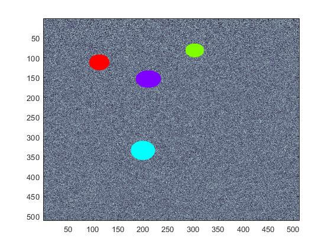
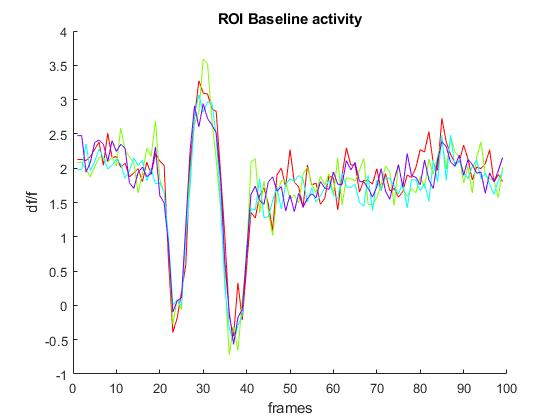

# CaBMI
In-development Calcium imaging BMI scripts for 2P imaging.

## Overview

Scripts for the on-line analysis of user defined regions of interest (ROIs) for
mice Brain Machine Interface (BMI) experiments.

## Hardware Prerequisites

These functions are dependent on the proprietary Bruker 2P (Ultima) Microscope interface,
which by current design is not 'real time', and is susceptible to delays
like OS scheduling, etc. that increase jitter in the on-line analysis
and feedback deployment. Most software prototyping is in MATLAB.

The hardware output interface is an arduino usb device, controlled with MATLAB software.


## Basic Pipeline


### PreFlight- Hardware communication

Connect to the Microscope over matlab via PrairieLink:

```
pl = actxserver('PrairieLink.Application');
pl.Connect();
pl.SendScriptCommands('-lbs true 5')
```

Connect to Arduino through a serial interface in MATLAB

```
arduino=serial('COM13','BaudRate',9600); % create serial communication object on port COM4
fopen(arduino); % initiate arduino communication

```


###  ROI selection
Create a Reference Image, and Manually select Regions of Interest:


```
>> [I, M, ROI] = CaBMI_Dendrites(I); % input 'I' if you preloaded data
```

This function will also save ROI data to the local directory.


Plot these ROIs, and the underlying time series:
```
caBMI_refPlot(ROI,Im1)
```

ROIs are color coded:



The resulting Time-series for each ROI, with color matching the ROI Map above:




### BMI On-line Feedback

Experiment will be run for the amount of time listed in ```max_time``` which must be specified.


```
% Run experiment
max_time = 30; %seconds
[data] = caBMI_feedback(pl,s,ROI,max_time)
```

BMI contingency will be set in a separate function. Currently this function is called ```WAL3_cursor```.
